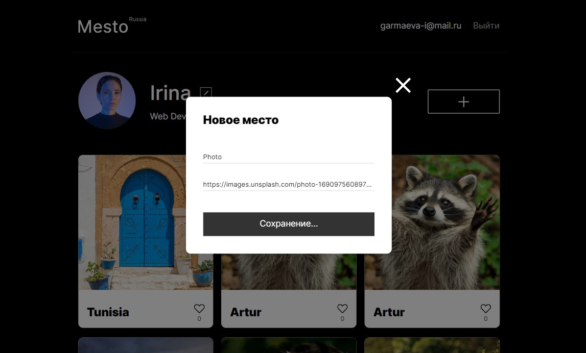
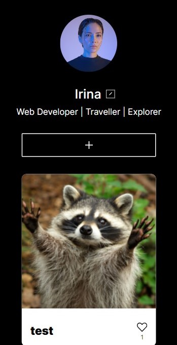

# Edicational purpose project "Mesto" on React from [Yandex Practicum](https://practicum.yandex.ru/) Web-developer course.

## Description

Project `Mesto` is spa where users can share photos, delete them, and like them, as well as change user information and avatar. Forms are validated on the user's side. It's the second stage of creating a social network partially replicates the functionality of Instagram.
[Previous project version on vanilla JS](https://github.com/IrinaGarmaeva/mesto-react)

## Functionality

* User registration and authorization
* Edit user data
* Update avatar
* Add a new card
* Put and remove likes (including like counter)
* Modal window with an enlarged photo of the card
* Delete a card created by the user with a confirmation modal window
* Data exchange with the server
* Open and close modal windows using the close button and overlay

## Technologies Used

- HTML5;
- CSS3:
    - Flexbox;
    - Grid Layout;
    - Positioning;
    - Adaptive UI;
    - Media Queries;
- BEM methodology (nested/flat);
- JavaScript:
    - CamelCase style;
    - Object-oriented programming;
    - Promise, asynchronous functions;
    - API (Application Programming Interface);
- Webpack:
    - Project files are bundled using [Webpack](https://webpack.js.org/) technology, which takes the dependencies and generates a dependency graph allowing web developers to use a modular approach for their web application development purposes.
- React JS:
    - Create React App;
    - JSX;
    - Functional components;
    - Hooks.

## Screenshots

<b>Show all</b>

## Usage
Clone repository:

  `git clone git@github.com:IrinaGarmaeva/react-mesto-auth.git`

Install dependencies:

  `npm install`

Run app:

  `npm run start`

## Figma designs:

- [Figma 4](https://www.figma.com/file/2cn9N9jSkmxD84oJik7xL7/JavaScript.-Sprint-4);
- [Figma 5](https://www.figma.com/file/bjyvbKKJN2naO0ucURl2Z0/JavaScript.-Sprint-5);
- [Figma 6-7](https://www.figma.com/file/kRVLKwYG3d1HGLvh7JFWRT/JavaScript.-Sprint-6);
- [Figma 9](https://www.figma.com/file/PSdQFRHoxXJFs2FH8IXViF/JavaScript-9-sprint);
- [Figma 12](https://www.figma.com/file/5H3gsn5lIGPwzBPby9jAOo/JavaScript.-Sprint-12).

